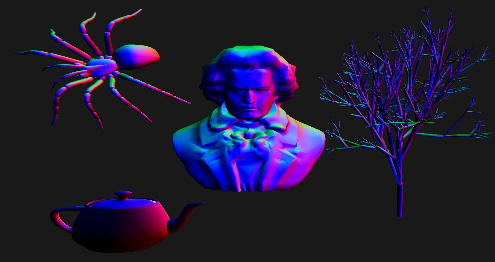
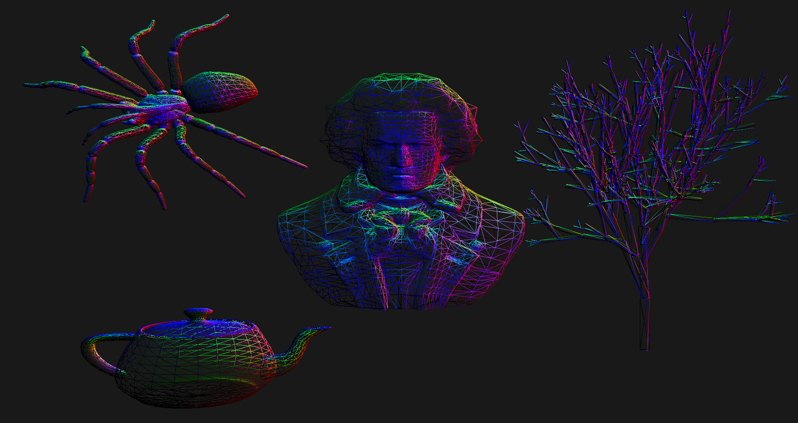
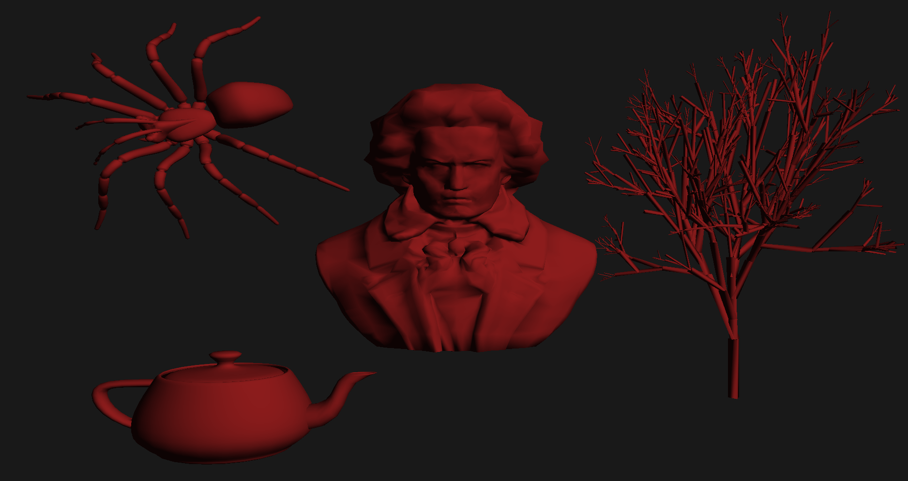
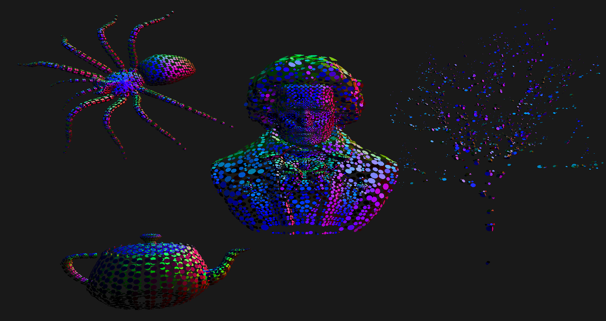

# Splats in OpenGL

Splats are incircles drawn inside triangles in wireframe meshes. This program demonstrates splat render given an input set of vertices and faces for the mesh. The radius of the circle can be modified using `j`/ `k` keys


The program includes additional features such as:
* Multiple objects
* Normal coloring
* Wireframe mode
* User input controlled transformations like rotation, translation, scaling
* Diffuse lighting
* Custom-written ply parser
* MVC architecture


## Dependencies

## Execution
To execute the program: 
```make run
```

For key bindings, refer to `key_bindings.txt`

# Screenshots

### Normal coloring

### Wireframe

### Diffuse lighting

### Splats

